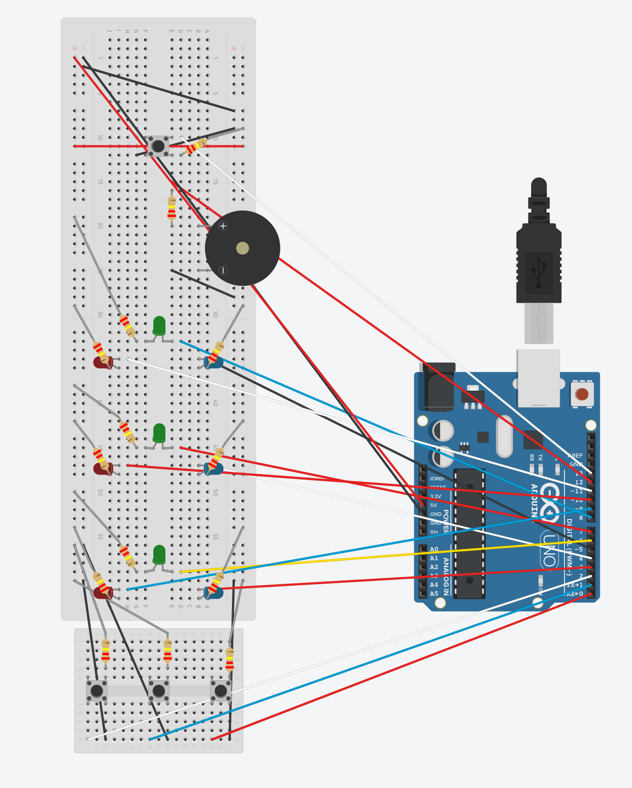
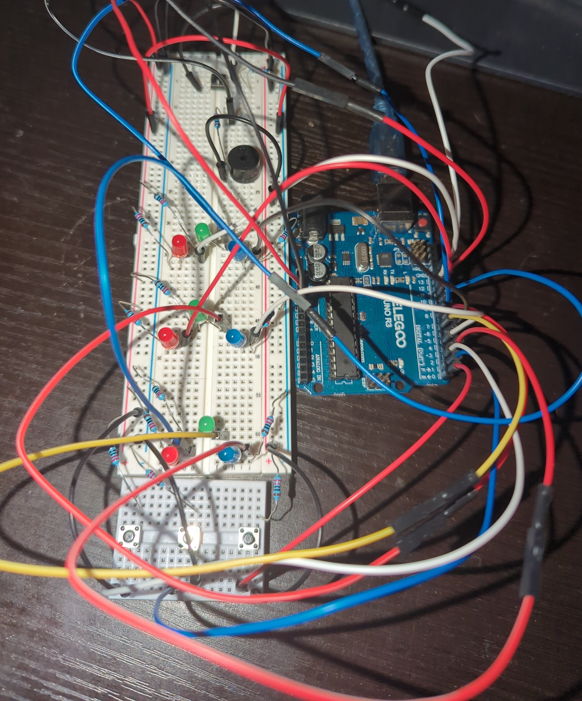

# Dance-Dance-Hero
Where DDR meets Guitar Hero! 🕹️ 🎸

# 🌟 What is it?

Dance Dance Hero combines the best of Dance Dance Revolution and Guitar Hero into one awesome rhythm experience! Players must hit the right notes at the right time as they cascade down three colorful LED columns.

# 🎯 Gameplay

🔴 🟢 🔵 Notes "fall" down three vibrant LED columns (red, green, and blue)

⏱️ Press the corresponding buttons when notes reach the bottom row

🎶 Jam to the iconic Super Mario Bros theme while playing in perfect sync

🏆 Score points based on your timing accuracy

🎬 Different endings based on your performance - can you get the perfect score?

# 🛠️ Technical Details

• Built with an Arduino R3 Uno

• Programmed using the Arduino IDE and C++

• Created as a passion project and final assignment for my mechatronics class

# Final Product

